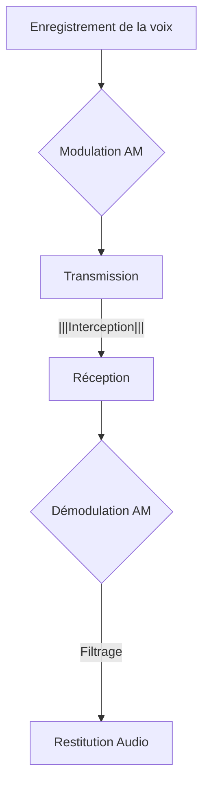

## Lecture d'un fichier RAW
**Le pitch :**
*Vous venez d’intégrer une équipe d’analystes de radio-fréquences. Pour votre première mission, ils vous demandent de décoder cette transmission capturée avec un taux d’échantillonage de 60000 Hz.*
[Lien du challenge](https://www.root-me.org/fr/Challenges/Reseau/RF-AM-Transmission)

Nous savons que le signal a été *Modulé en Amplitude* (AM). Cela signifie que l'oscillation électrique générée par la voix enregistrée a été *modulé* à l'aide d'une fréquence dite *porteuse*, avant d'être transmise.
A l'arrivée, le récepteur fait l'opération inverse en *démodulant* le signal pour récupérer l'information d'origine.



Il existe plusieurs méthodes toutes valides, mettant à profit des outils différents.
Nous allons en explorer quelques unes !

### Méthode 1 : GNU Radio
L'outil de référence en manipulation et analyse de fichiers radio est **gnuradio**, une boite fonctionnelle accompagnée d'un GUI **gnuradio-companion** (il peut avoir besoin d'être installé en parallèle selon les systèmes).

Le logiciel fonctionne par *blocs* fonctionnels. 
A l'ouverture, seuls deux sont présents : 
- **Options**
- et **Variable**

Le bloc variable va nous servir à renseigner le *sample rate*, ou taux d'échantillonnage (dont on connait la valeur).

Pour retrouver l'information présente dans notre fichier brut, nous allons avoir besoin de *démoduler* notre signal.
On aura donc besoin des blocs :
- **File source** pour charger notre signal brut
- **Throttle** petite subtilité, pour demander au pc de ne pas lire le fichier aussi vite que possible (le résultat serait inaudible)
- **Complex to Mag**  pour convertir le signal complexe en sa magnitude (enveloppe du signal).
- **Low pass band filter**, filtre passe-bas pour extraire l'information utile.
- Et enfin **Audio sink** pour le résultat final.

 



### Méthode 2 : essayons avec python
Pour convertir un fichier `.raw`, nous allons avoir besoin des bibliothèques :
- numpy 
- scipy
- matplotlib

#### Les étapes :
1. **Charger la capture :** avec numpy
2. **Démoduler le signal AM **
3. **Filtrer le signal démodulé**
4. **Visualiser le signal démodulé :** c'est bonus, mais pour ça on peut utiliser matplotlib.

Exemple de structure de code :
```python
import numpy as np
import scipy.signal as signal
import matplotlib.pyplot as plt

# Charger le fichier raw
filename = "am_capture.raw"
sample_rate = 48000  # Fréquence d'échantillonnage du signal à modifier
data = np.fromfile(filename, dtype=np.float32)

# Afficher le signal brut
plt.figure()
plt.plot(data[:1000])
plt.title("Signal AM brut")
plt.xlabel("Échantillons")
plt.ylabel("Amplitude")
plt.show()

# Démoduler le signal AM (enveloppe)
demodulated_signal = np.abs(signal.hilbert(data))

# Filtrer le signal démodulé avec un filtre passe-bas
nyquist_rate = sample_rate / 2.0
cutoff_freq = 5000.0  # Fréquence de coupure du filtre passe-bas
norm_cutoff_freq = cutoff_freq / nyquist_rate

# Conception du filtre passe-bas
b, a = signal.butter(5, norm_cutoff_freq, btype='low')
filtered_signal = signal.filtfilt(b, a, demodulated_signal)

# Afficher le signal démodulé et filtré
plt.figure()
plt.plot(filtered_signal[:1000])
plt.title("Signal AM démodulé et filtré")
plt.xlabel("Échantillons")
plt.ylabel("Amplitude")
plt.show()

# Sauvegarder le signal démodulé et filtré dans un fichier WAV si nécessaire
import scipy.io.wavfile as wav

output_filename = "demodulated_signal.wav"
wav.write(output_filename, sample_rate, filtered_signal.astype(np.float32))
```
